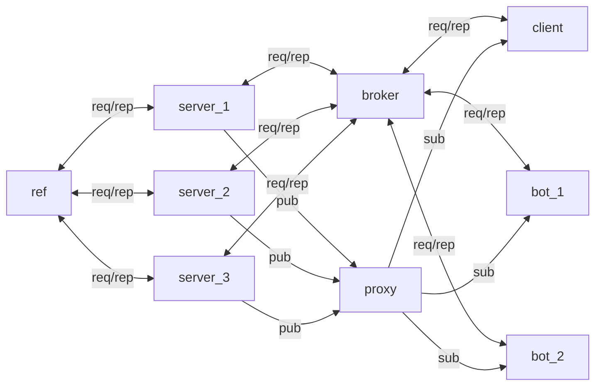
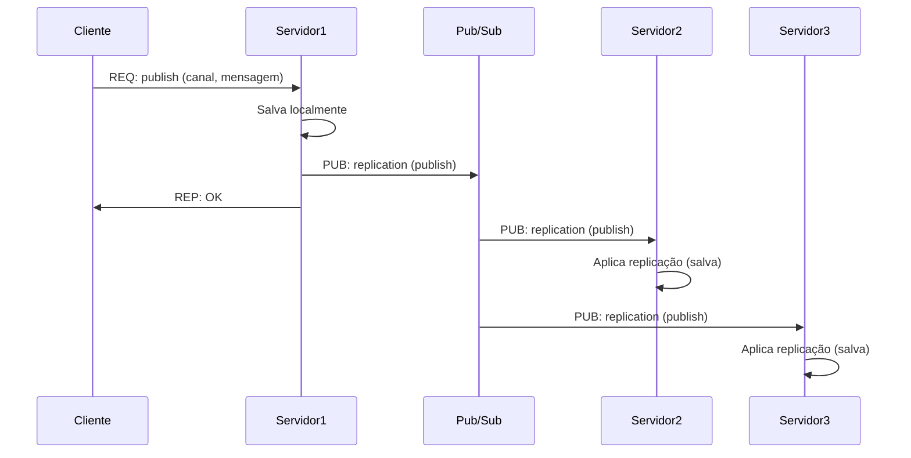

# 💬 **Sistema de Troca de Mensagens Bulletin Board**

## Visão Geral do Projeto

Este projeto consiste no desenvolvimento de uma versão simplificada de um sistema de troca de mensagens instantâneas.

O objetivo principal é aplicar conceitos de **Sistemas Distribuídos** para construir um serviço que permita a comunicação em tempo real e a persistência de dados.

## 🎯 Funcionalidades Principais

O sistema implementa as seguintes interações básicas entre usuários e o serviço:

* **Mensagens Privadas (P2P):** Troca de mensagens diretas entre dois usuários.
* **Canais Públicos:** Postagem e visualização de mensagens em canais de discussão abertos.
* **Persistência de Dados:** Todas as interações (mensagens privadas e postagens em canais) são armazenadas em disco, permitindo que os usuários recuperem o histórico de mensagens anteriores.

---

## 👩‍💻 Cliente

### Mensagens Enviadas
- `login`: `{ service: "login", data: { user, timestamp, clock } }`
- `users`: `{ service: "users", data: { timestamp, clock } }`
- `channel`: `{ service: "channel", data: { channel, timestamp, clock } }`
- `channels`: `{ service: "channels", data: { timestamp, clock } }`
- `publish`: `{ service: "publish", data: { user, channel, message, timestamp, clock } }`
- `message`: `{ service: "message", data: { src, dst, message, timestamp, clock } }`

### Mensagens Recebidas
- Respostas REP do servidor com `status`, `timestamp`, `clock` e, quando aplicável, campos de erro (`description`/`message`).
- Publicações via proxy (`proxy:5558`) para:
  - Tópico com o nome do usuário (mensagens privadas).
  - Tópicos de canais inscritos (mensagens em canais).

O cliente interativo (`cliente.py`) e o cliente automático (`cliente_automatico.py`) compartilham o mesmo protocolo MessagePack, incrementando o relógio lógico antes de cada envio e atualizando com base nas mensagens recebidas.

---

## 🛠️ Tecnologias e Arquitetura

Este projeto seguiu um conjunto de padronizações para garantir a interoperabilidade e a testabilidade, e integrou escolhas livres de tecnologia para demonstrar proficiência em múltiplas linguagens e armazenamento de dados.

### 🐳 Arquitetura em Containers

O ambiente distribuído roda inteiramente em containers Docker orquestrados via `docker compose`. A topologia foi organizada para refletir o enunciado do projeto, com três instâncias de servidor compartilhando o mesmo código, dois clientes automáticos (bots) gerando carga, um cliente interativo, um broker, um proxy Pub/Sub e o servidor de referência que provê eleição e sincronização.



No arquivo `docker-compose.yml` os serviços com múltiplas instâncias (`servidor` e `cliente_automatico`) são declarados com `deploy.replicas`, garantindo que todas as réplicas utilizem exatamente o mesmo código e configuração.

---

## 🖥️ Servidor

### Mensagens Recebidas
- Requisições REQ/REP encaminhadas pelo broker (`broker:5556`) com `service`/`data` serializados em MessagePack.
- Chamadas ao servidor de referência (`rank`, `list`, `heartbeat`) para eleição, monitoramento e clock lógico.
- Publicações via proxy (`proxy:5558`) nos tópicos `servers` (anúncio de coordenador) e `replication` (eventos de dados).
- Requisições diretas de outros servidores (`election`, `clock`) na porta 5560.

### Mensagens Enviadas
- Respostas REP aos clientes preservando o `service` original e preenchendo `status`, `timestamp`, `clock` e mensagens de erro quando necessário.
- Publicações em canais e mensagens privadas via proxy (`proxy:5557`), usando o nome do canal ou do destinatário como tópico.
- Eventos de replicação no tópico `replication`, incluindo `operation`, `operationData`, `serverName`, `timestamp` e `clock`.
- Broadcasts no tópico `servers` anunciando novos coordenadores.
- Replies `rank/list/heartbeat` para o servidor de referência e `election/clock` para outros servidores.

Todas as operações mutáveis são persistidas em `data/` (arquivos JSON) e replicadas para garantir consistência eventual entre as réplicas.

### 🌐 Padronizações (Requisitos do Enunciado)

| Componente | Detalhe |
| :--- | :--- |
| **Comunicação** | Uso da biblioteca **ZeroMQ (ØMQ)** para a troca de mensagens entre os atores do sistema (clientes e servidor). |
| **Formato de Mensagem** | As mensagens seguem um **padrão definido** (descrito na documentação técnica) para garantir a interconexão. |
| **Ambiente de Teste** | Utilização de **Containers** (`Docker`) para encapsular e executar as instâncias de cada ator (cliente e servidor), facilitando os testes de ambiente distribuído. |

### Como Executar

**(Aqui você descreveria, de forma resumida, os passos para clonar, construir as imagens Docker e iniciar o servidor e clientes.)**

1.  Clone o repositório: `git clone https://github.com/gbalbuquerque/BulletinBoard.git`
2.  Navegue até o diretório do projeto
3.  Construa as imagens dos containers (se aplicável): `docker compose build`
4.  Inicie o sistema: `docker compose up`

---

## 🔄 Consistência e Replicação de Dados

### Problema Identificado

O sistema utiliza um broker com balanceamento de carga do tipo **round-robin**, onde as requisições dos clientes são distribuídas sequencialmente entre os servidores disponíveis. Isso resulta em uma situação onde:

- Cada servidor recebe apenas uma **parte** das mensagens trocadas no sistema
- Se um servidor falhar, **perde-se o histórico** de mensagens que ele processou
- Quando um cliente solicita o histórico de mensagens, recebe apenas os dados armazenados no servidor que atendeu a requisição, não o histórico completo

### Solução Implementada: Replicação Multi-Master com Pub/Sub

Foi implementado um sistema de **replicação Multi-Master** utilizando o padrão **Publisher-Subscriber** já existente no projeto. Este método foi escolhido porque:

1. **Alta Disponibilidade**: Todos os servidores podem processar requisições e manter dados atualizados
2. **Tolerância a Falhas**: Se um servidor falhar, os outros continuam com dados completos
3. **Desempenho**: Não há gargalo de um servidor primário único
4. **Simplicidade**: Aproveita a infraestrutura Pub/Sub já implementada

### Funcionamento

#### 1. Processamento de Operações

Quando um servidor processa uma operação que **modifica dados** (login, criação de canal, publicação em canal, ou mensagem direta), ele:

1. **Executa a operação localmente** (salva no banco de dados local)
2. **Publica uma mensagem de replicação** no tópico `"replication"` via Pub/Sub
3. **Retorna resposta ao cliente** normalmente

#### 2. Recebimento de Replicações

Cada servidor possui um **subscriber** inscrito no tópico `"replication"` que:

1. **Recebe mensagens de replicação** de outros servidores
2. **Verifica se a mensagem não é do próprio servidor** (evita loops)
3. **Aplica a mesma operação localmente** sem replicar novamente (flag `isReplicating`)
4. **Atualiza o relógio lógico** conforme a mensagem recebida

#### 3. Operações Replicadas

As seguintes operações são replicadas entre servidores:

- **`login`**: Cadastro de novos usuários
- **`channel`**: Criação de novos canais
- **`publish`**: Publicações em canais
- **`message`**: Mensagens diretas entre usuários

### Formato das Mensagens de Replicação

As mensagens de replicação seguem o formato MessagePack e são publicadas no tópico `"replication"`:

```json
{
  "service": "replication",
  "data": {
    "operation": "login" | "channel" | "publish" | "message",
    "operationData": {
      // Dados específicos da operação
      // Para login: { "user": "...", "timestamp": ... }
      // Para channel: { "channel": "...", "timestamp": ... }
      // Para publish: { "channel": "...", "user": "...", "message": "...", "timestamp": ... }
      // Para message: { "src": "...", "dst": "...", "message": "...", "timestamp": ... }
    },
    "serverName": "nome_do_servidor_origem",
    "timestamp": 1234567890,
    "clock": 42
  }
}
```

### Modificações no Método Tradicional

O método Multi-Master tradicional foi adaptado para este projeto com as seguintes modificações:

1. **Uso de Pub/Sub ao invés de comunicação direta**: Aproveita a infraestrutura existente e simplifica a implementação
2. **Flag de replicação**: Evita loops infinitos onde um servidor replica sua própria replicação
3. **Identificação do servidor origem**: Cada mensagem inclui o nome do servidor que originou a operação, permitindo que servidores ignorem suas próprias replicações
4. **Sincronização de relógio lógico**: As mensagens de replicação incluem o valor do relógio lógico para manter a consistência temporal

### Diagrama de Sequência



### Garantias de Consistência

- **Consistência Eventual**: Todos os servidores eventualmente terão os mesmos dados
- **Idempotência**: Aplicar a mesma replicação múltiplas vezes não causa problemas (verificações de existência)
- **Ordem Parcial**: O relógio lógico garante ordem parcial das operações

### Limitações e Considerações

1. **Consistência Eventual**: Há um pequeno delay entre a operação original e sua replicação
2. **Sem Resolução de Conflitos**: Não há mecanismo para resolver conflitos se dois servidores modificarem os mesmos dados simultaneamente (não é necessário neste projeto devido à natureza das operações)
3. **Perda de Mensagens**: Se um servidor estiver offline durante uma replicação, ele não receberá aquela mensagem específica (poderia ser implementado um mecanismo de sincronização inicial)

